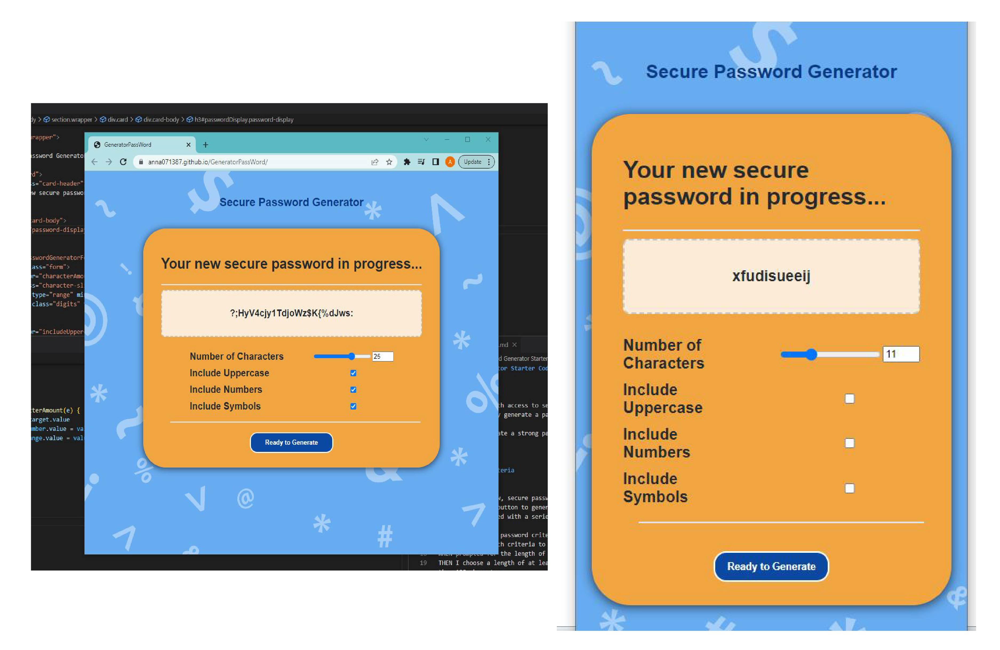

# Random Password Creator MalarKey

https://anna071387.github.io/MalarKey/

## Project purpose
This applications is designed to 
help creating a random password on every click. 

## Usage
It contains built-in attributes to manipulate desired number of characters, control type of characters to include. For instance one may control to include only an upper case, only numbers or only symbols. Or comibine all together. The lowercase elements are default.

 One may easily manipulate the slide bar to assign the amount of characters or manually input the number on the number of characters line. Additionally, one can use the incremental up and down arrows for more control to assign the amount of characters starting from 8 to 128 characters. 

## Results
This allows crafting a well secured password.

## Design
The application designed to adjust with the amount of characters output and user friendly design for different screen sizes. 

The background cover image was incorporated for visual appeal and playfulness of the design. 

Colors were chosen to communicate stability-security (blue) and alertness (orange) of the password.

## Credits
Starter code Provided by:
© 2023 edX Boot Camps LLC. Confidential and Proprietary. All Rights Reserved.

Inspiration for usability: Web Development Simplified Tutorial "Build a password generator with JavaScript - Tutorial" 
